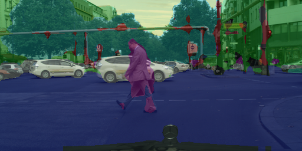

# Keras Image Segmentation

Semantic Segmentation easy code for keras users.

We use [cityscape dataset](https://www.cityscapes-dataset.com/) for training various models.

Use pretrained VGG16 weight for FCN and U-net! You can 
[download weights](https://github.com/fchollet/deep-learning-models/releases/download/v0.1/vgg16_weights_tf_dim_ordering_tf_kernels_notop.h5)
offered by keras.

## Tested Env
- python 2 & 3
- tensorflow 1.5
- keras 2.1.4
- opencv 3.3

## File Description
| File | Description |
|:------|:------------|
| train.py | Train various models. |
| test.py | Predict one picture what you want. |
| dataest_parser/make_h5.py | Parse cityscape dataset and make h5py file. |
| dataest_parser/generator.py | Data_generator with augmentation using data.h5 |
| model/ | Folder that contains various models for semantic segmentation |
| segmentation_dh/ | Experiment folder for Anthony Kim(useless contents for users) |
| segmentation_tk/ | Experiment folder for TaeKang Woo(useless contents for users) |
| temp/ | Folder that contains various scripts we used(useless contents for users) |

## Implement Details
##### We scale down the image (scale 1/4) for fast model test.

You can change scale_rate when you execute make_h5.py.

After you change scale_rate, you also have to give same rate value to train.py and test.py parameter.

##### We use 8 classes for cityscape segmentation.

You can change the number of classes from 8 to 4 when you execute train.py for faster convergence if you want.

After you change the number of classes, you also have to give same num_classes to train.py and test.py parameter.

8classes = \[void, flat, construction, obj, nature, sky, human, vehicle]

4classes = \[background, person, car, road]

## Simple Tutorial
**First**, you have to make .h5 file with data!
```bash
python3 dataset_parser/make_h5.py --path "/downloaded/leftImg8bit/path/" --gtpath "/downloaded/gtFine/path/"
```
| Option | Description | Required | Default |
|:-------|:------------|:--------:|:-------:|
| --path | Downloaded leftImg8bit folder path. | O | - |
| --gtpath | Downloaded gtFine path. | O | - |
| --scale | Scale size of image. | X | 0.25 |

After you run above command, 'data.h5' file will appear in folder.

( data.h5 should be at /downloaded/path/keras-image-segmentation/data.h5 )

**Second**, Train your model!
```bash
python3 train.py --model fcn
```

After the second step, tested image_files while you training will appear in img folder.

| Option | Description | Required | Default |
|:-------|:------------|:--------:|:-------:|
| --model | Model to train. \['fcn', 'unet', 'pspnet', 'deeplab'\] | O | - |
| --scale | Scale size of image | X | 0.25 |
| --num_classes | number of classes | X | 8 |
| --train_batch | Batch size for train. | X | 4 |
| --val_batch | Batch size for validation. | X | 1 |
| --lr_init | Initial learning rate. | X | 1e-4 |
| --lr_decay | How much to decay the learning rate. | X | 5e-4 |
| --vgg | Pretrained vgg16 weight path. | X | None |

**Finally**, test your model!
```bash
python3 test.py --model fcn
```
| Option | Description | Required | Default |
|:-------|:------------|:--------:|:-------:|
| --model | Model to test. \['fcn', 'unet', 'pspnet'\] | O | - |
| --img_path | The image path you want to test | X | 'img/test.png' |
| --scale | Scale size of image | X | 0.25 |
| --num_classes | number of classes | X | 8 |

## Result of scale_down(1/4) cityscape dataset.
| model | dice_coef | mIoU | precision | recall |
|:-----:|:---------:|:----:|:---------:|:------:|
| FCN_8s | 0.86 | 0.84 | 0.93 | 0.88 |
| Unet | 0 | 0 | 0 | 0 |
| PSPnet | 0 | 0 | 0 | 0 |
| deeplab_v3+ | 0 | 0 | 0 | 0 |

|  |  |
|:-----------------------------------------:|:-----------------------------------------:|
| *fcn_8s 100_epoch* | *unet 100_epoch* |
|  |  |
| *pspnet 100_epoch* | *deeplab_v3 100_epoch* |

## Todo
- [x] FCN
- [x] Unet
- [x] PSPnet
- [x] DeepLab_v3+
- [ ] Mask_RCNN
- [x] Evauate methods(calc mIoU)

## Contact us!
Anthony Kim: artit.anthony@gmail.com

TaeKang Woo: wtk1101@gmail.com
