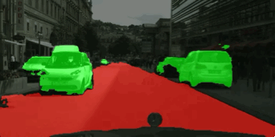

# Keras Image Segmentation

Semantic Segmentation easy code for keras users.


<p align="center">
    
</p>
<br>

We use [cityscape dataset](https://www.cityscapes-dataset.com/) for training various models.

Use pretrained VGG16 weight for FCN and U-net! You can 
[download weights](https://github.com/fchollet/deep-learning-models/releases/download/v0.1/vgg16_weights_tf_dim_ordering_tf_kernels_notop.h5)
offered by keras.

## Tested Env
- python 2 & 3
- tensorflow 1.5
- keras 2.1.4
- opencv 3.3

## File Description
| File | Description |
|:------|:------------|
| train.py | Train various models. |
| test.py | Predict one picture what you want. |
| dataest_parser/make_h5.py | Parse cityscape dataset and make h5py file. |
| dataest_parser/generator.py | Data_generator with augmentation using data.h5 |
| model/ | Folder that contains various models for semantic segmentation |
| segmentation_dh/ | Experiment folder for Anthony Kim(useless contents for users) |
| segmentation_tk/ | Experiment folder for TaeKang Woo(useless contents for users) |
| temp/ | Folder that contains various scripts we used(useless contents for users) |

## Implement Details
We used only **three classes** in the [cityscape dataset](https://www.cityscapes-dataset.com/) for a simple implementation.

Person, Car, and Road.

## Simple Tutorial
**First**, you have to make .h5 file with data!
```bash
python3 dataset_parser/make_h5.py --path "/downloaded/leftImg8bit/path/" --gtpath "/downloaded/gtFine/path/"
```
After you run above command, 'data.h5' file will appear in dataset_parser folder.

**Second**, Train your model!
```bash
python3 train.py --model fcn
```
| Option | Description |
|:-------|:------------|
| --model | Model to train. \['fcn', 'unet', 'pspnet'\] |
| --train_batch | Batch size for train. |
| --val_batch | Batch size for validation. |
| --lr_init | Initial learning rate. |
| --lr_decay | How much to decay the learning rate. |
| --vgg | Pretrained vgg16 weight path. |

**Finally**, test your model!
```bash
python3 test.py --model fcn
```
| Option | Description |
|:-------|:------------|
| --model | Model to test. \['fcn', 'unet', 'pspnet'\] |
| --img_path | The image path you want to test |

## Todo
- [x] FCN
- [x] Unet
- [x] PSPnet
- [ ] DeepLab_v3
- [ ] Mask_RCNN
- [ ] Evauate methods(calc mIoU)

## Contact us!
Anthony Kim: artit.anthony@gmail.com

TaeKang Woo: wtk1101@gmail.com
